# Skills Index

> **Central hub for all skills** - Navigate, discover, and understand skill dependencies

---

## Quick Navigation

### Core Skills (Universal)

| Skill | Description | Dependencies |
|-------|-------------|--------------|
| [code-review](core/code-review/SKILL.md) | Systematic code review with technical rigor | - |
| [git-automation](core/git-automation/SKILL.md) | Git workflow automation and commit standards | - |
| [retrospect-work](core/retrospect-work/SKILL.md) | Self-learning retrospects for continuous improvement | - |
| [agent-creation](core/agent-creation/SKILL.md) | Guide for creating agents with skills.sh integration | - |
| [sequential-thinking](core/sequential-thinking/SKILL.md) | Systematic step-by-step reasoning for complex problems | - |
| [knowledge-graph](core/knowledge-graph/SKILL.md) | Entity-relation storage for cross-agent knowledge | - |

### Domain Skills

#### Frontend

| Skill | Description | Dependencies |
|-------|-------------|--------------|
| [frontend-design](domain/frontend/frontend-design/SKILL.md) | React/Vue component design patterns | code-review |
| [accessibility](domain/frontend/accessibility/SKILL.md) | WCAG compliance and a11y best practices | frontend-design |
| [state-management](domain/frontend/state-management/SKILL.md) | Zustand, TanStack Query patterns | frontend-design |
| [testing-fe](domain/frontend/testing-fe/SKILL.md) | Vitest + Testing Library | code-review |
| [performance-fe](domain/frontend/performance-fe/SKILL.md) | React optimization, Core Web Vitals | frontend-design |
| [ui-ux-pro-max](domain/frontend/ui-ux-pro-max/SKILL.md) | UI/UX design intelligence with 67 styles, 96 palettes | frontend-design |

#### Backend

| Skill | Description | Dependencies |
|-------|-------------|--------------|
| [api-design](domain/backend/api-design/SKILL.md) | RESTful/GraphQL API design patterns | code-review |
| [database-design](domain/backend/database-design/SKILL.md) | Database schema and query optimization | code-review |
| [security](domain/backend/security/SKILL.md) | Backend security patterns and OWASP | api-design |
| [testing-be](domain/backend/testing-be/SKILL.md) | Backend testing patterns | code-review, api-design |
| [performance-be](domain/backend/performance-be/SKILL.md) | Backend optimization, caching | database-design, api-design |

#### Architecture

| Skill | Description | Dependencies |
|-------|-------------|--------------|
| [system-design](domain/architecture/system-design/SKILL.md) | Distributed systems and scalability patterns | - |
| [architecture-patterns](domain/architecture/architecture-patterns/SKILL.md) | Microservices, monolith, serverless patterns | system-design |
| [adr-writing](domain/architecture/adr-writing/SKILL.md) | Architecture Decision Records | - |
| [tech-selection](domain/architecture/tech-selection/SKILL.md) | Technology evaluation framework | adr-writing |
| [performance-engineering](domain/architecture/performance-engineering/SKILL.md) | Performance optimization strategies | system-design |
| [security-architecture](domain/architecture/security-architecture/SKILL.md) | Security architecture patterns | system-design, security |
| [c4-architecture](domain/architecture/c4-architecture/SKILL.md) | Generate C4 model architecture diagrams in Mermaid | system-design |
| [mermaid-diagrams](domain/architecture/mermaid-diagrams/SKILL.md) | Comprehensive guide for creating Mermaid diagrams | - |

#### DevOps

| Skill | Description | Dependencies |
|-------|-------------|--------------|
| [ci-cd](domain/devops/ci-cd/SKILL.md) | CI/CD pipelines (GitHub Actions, GitLab CI) | git-automation |
| [containerization](domain/devops/containerization/SKILL.md) | Docker patterns and best practices | - |
| [infrastructure-as-code](domain/devops/infrastructure-as-code/SKILL.md) | Terraform/IaC patterns | - |
| [monitoring](domain/devops/monitoring/SKILL.md) | Prometheus, Grafana observability | - |
| [deployment](domain/devops/deployment/SKILL.md) | Blue/green, canary deployment strategies | ci-cd |

#### Product

| Skill | Description | Dependencies |
|-------|-------------|--------------|
| [requirements-gathering](domain/product/requirements-gathering/SKILL.md) | User requirements collection techniques | - |
| [user-stories](domain/product/user-stories/SKILL.md) | User story writing and refinement | requirements-gathering |
| [sprint-planning](domain/product/sprint-planning/SKILL.md) | Sprint planning and estimation | user-stories |
| [roadmap-planning](domain/product/roadmap-planning/SKILL.md) | Product roadmap creation | sprint-planning |
| [stakeholder-communication](domain/product/stakeholder-communication/SKILL.md) | Stakeholder management | - |
| [requirements-clarity](domain/product/requirements-clarity/SKILL.md) | Transform vague requirements into actionable PRDs | requirements-gathering |

#### Quality

| Skill | Description | Dependencies |
|-------|-------------|--------------|
| [test-planning](domain/quality/test-planning/SKILL.md) | Test strategy and planning | - |
| [bug-reporting](domain/quality/bug-reporting/SKILL.md) | Bug report templates and best practices | - |
| [test-automation](domain/quality/test-automation/SKILL.md) | Test automation frameworks | test-planning |
| [regression-testing](domain/quality/regression-testing/SKILL.md) | Regression test strategies | test-automation |

#### Design

| Skill | Description | Dependencies |
|-------|-------------|--------------|
| [ui-design](domain/design/ui-design/SKILL.md) | UI design principles for professional, accessible interfaces | - |
| [design-system](domain/design/design-system/SKILL.md) | Design system with tokens, components, patterns | ui-design |
| [responsive-design](domain/design/responsive-design/SKILL.md) | Mobile-first responsive design with breakpoints | ui-design |
| [html-css-output](domain/design/html-css-output/SKILL.md) | Converting designs to HTML/CSS for developers | ui-design, design-system |
| [mockup-creation](domain/design/mockup-creation/SKILL.md) | Creating wireframes and mockups with DrawIO | ui-design |

### Leadership Skills

| Skill | Description | Dependencies |
|-------|-------------|--------------|
| [code-review-advanced](leadership/code-review-advanced/SKILL.md) | Advanced code review for Tech Leads | code-review |
| [technical-decision](leadership/technical-decision/SKILL.md) | Technical decision-making framework | adr-writing |
| [mentoring](leadership/mentoring/SKILL.md) | Developer mentoring techniques | - |
| [technical-debt](leadership/technical-debt/SKILL.md) | Technical debt management | code-review-advanced |

---

## Skill Dependency Graph

```mermaid
graph TD
    subgraph Core
        CR[code-review]
        GA[git-automation]
        RW[retrospect-work]
    end

    subgraph Frontend
        FD[frontend-design]
        A11Y[accessibility]
        SM[state-management]
        TFE[testing-fe]
        PFE[performance-fe]
    end

    subgraph Backend
        API[api-design]
        DB[database-design]
        SEC[security]
        TBE[testing-be]
        PBE[performance-be]
    end

    subgraph Architecture
        SD[system-design]
        AP[architecture-patterns]
        ADR[adr-writing]
        TS[tech-selection]
        PE[performance-engineering]
        SA[security-architecture]
    end

    subgraph DevOps
        CICD[ci-cd]
        CONT[containerization]
        IAC[infrastructure-as-code]
        MON[monitoring]
        DEP[deployment]
    end

    subgraph Product
        RG[requirements-gathering]
        US[user-stories]
        SP[sprint-planning]
        RP[roadmap-planning]
        SC[stakeholder-communication]
    end

    subgraph Quality
        TP[test-planning]
        BR[bug-reporting]
        TA[test-automation]
        RT[regression-testing]
    end

    subgraph Leadership
        CRA[code-review-advanced]
        TD[technical-decision]
        MEN[mentoring]
        TDEBT[technical-debt]
    end

    %% Core dependencies
    FD --> CR
    API --> CR
    DB --> CR
    TFE --> CR

    %% Frontend
    A11Y --> FD
    SM --> FD
    PFE --> FD

    %% Backend
    SEC --> API
    TBE --> CR
    TBE --> API
    PBE --> DB
    PBE --> API

    %% Architecture
    AP --> SD
    TS --> ADR
    PE --> SD
    SA --> SD
    SA --> SEC

    %% DevOps
    CICD --> GA
    DEP --> CICD

    %% Product
    US --> RG
    SP --> US
    RP --> SP

    %% Quality
    TA --> TP
    RT --> TA

    %% Leadership
    CRA --> CR
    TD --> ADR
    TDEBT --> CRA
```



---

## Use Case Guide

### "I'm building a new feature"

1. Start with **code-review** for quality standards
2. Use **git-automation** for commit workflow
3. Domain-specific:
   - Frontend: **frontend-design** → **accessibility** → **testing-fe**
   - Backend: **api-design** → **database-design** → **security** → **testing-be**
   - Architecture: **system-design** → **architecture-patterns**

### "I'm designing a new system"

1. **system-design** - Core architecture patterns
2. **architecture-patterns** - Choose your pattern (microservices, monolith, serverless)
3. **adr-writing** - Document your decisions
4. **tech-selection** - Evaluate technologies

### "I'm doing code review"

1. **code-review** - Review checklist and standards
2. **security** - Security considerations
3. **performance-engineering** - Performance patterns
4. **code-review-advanced** - For Tech Leads

### "I'm deploying to production"

1. **ci-cd** - Pipeline setup
2. **containerization** - Docker best practices
3. **monitoring** - Observability setup
4. **deployment** - Deployment strategies

### "I'm planning a sprint"

1. **requirements-gathering** - Collect requirements
2. **user-stories** - Write user stories
3. **sprint-planning** - Plan the sprint
4. **test-planning** - Plan testing strategy

---

## Skill Template

Each skill follows this structure:

```
skill-name/
├── SKILL.md           # Main instructions (<500 lines)
└── references/        # Optional: Detailed resources
    ├── guide.md
    └── examples.md
```

### YAML Front Matter

```yaml
---
name: skill-name
version: 1.0.0
description: |
  What this skill does and WHEN to use it.
  Triggers: keyword1, keyword2
category: domain-name
tags: [tag1, tag2]

# Dependency mechanism
depends_on: []           # Hard dependencies
recommends: []           # Soft dependencies
used_by: []              # Reverse reference
---
```

---

## Statistics

| Category | Count | Status |
|----------|-------|--------|
| Core | 6 | ✅ Complete |
| Frontend | 6 | ✅ Complete |
| Backend | 5 | ✅ Complete |
| Architecture | 8 | ✅ Complete |
| DevOps | 5 | ✅ Complete |
| Product | 6 | ✅ Complete |
| Quality | 4 | ✅ Complete |
| Design | 5 | ✅ Complete |
| Leadership | 4 | ✅ Complete |
| Community | 1 | ✅ Complete |
| **Total** | **50** | ✅ All Complete |

---

## Progressive Disclosure

Skills follow the 3-level architecture:

1. **Metadata (~100 tokens)** - Always loaded (name, description)
2. **Instructions (<5k tokens)** - Loaded when triggered (SKILL.md)
3. **Resources (unlimited)** - Loaded on demand (references/)

This ensures efficient context usage while providing deep documentation when needed.
