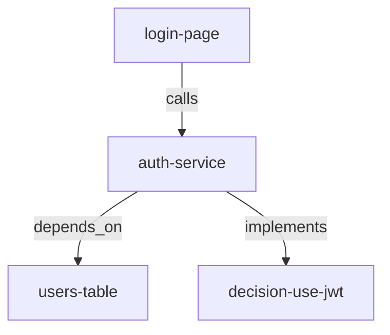

# Skill: Knowledge Graph

## Core Principle

**Projects are networks of connected components.**
Understanding relationships is as important as understanding individual parts.

## Purpose

Maintain structured knowledge about:
- Components and their types
- Relationships between components
- Decisions and their rationale
- Dependencies (internal and external)

## Entity Types

| Type | Description | Examples |
|------|-------------|----------|
| `component` | Code modules | auth-service, login-page, user-api |
| `api` | API endpoints | POST /auth/login, GET /users |
| `database` | Data stores | users-table, sessions-table |
| `decision` | ADRs/decisions | use-jwt-auth, postgres-choice |
| `external` | Third-party services | stripe-api, sendgrid |
| `pattern` | Design patterns | repository-pattern, factory-pattern |

## Relationship Types

| Relation | Meaning | Example |
|----------|---------|---------|
| `calls` | A invokes B | login-page → calls → auth-api |
| `depends_on` | A requires B | auth-service → depends_on → users-table |
| `implements` | A implements B | auth-service → implements → decision:use-jwt |
| `relates_to` | General connection | login-page → relates_to → register-page |
| `produces` | A outputs B | auth-api → produces → jwt-token |
| `consumes` | A uses B | dashboard → consumes → jwt-token |

## Storage Format

### File: `.claude/knowledge/graph.json`

```json
{
  "version": "1.0",
  "updated": "2025-02-27T10:00:00Z",
  "entities": [
    {
      "id": "auth-service",
      "type": "component",
      "description": "JWT authentication service",
      "owner": "dev-be",
      "tags": ["auth", "security"],
      "created": "2025-01-15"
    }
  ],
  "relations": [
    {
      "from": "login-page",
      "to": "auth-service",
      "type": "calls",
      "via": "POST /auth/login"
    }
  ]
}
```

## When to Update

### After Implementing New Features

```markdown
1. Identify new components created
2. Map connections to existing components
3. Add entities and relations to graph
4. Update MEMORY.md with key relationships
```

### When Making Architectural Decisions

```markdown
1. Create decision entity
2. Link to affected components
3. Document rationale in entity description
4. Cross-reference with ADR if exists
```

### After Refactoring

```markdown
1. Update component relationships
2. Mark deprecated relations
3. Add new relations created by refactor
4. Update descriptions if behavior changed
```

## Usage Patterns

### Query: What depends on X?

```
Find all relations where to = X and type = depends_on
```

### Query: What does X affect?

```
Find all relations where from = X
```

### Query: Decision trace

```
Find all entities of type decision
Follow implements relations to components
```

## Integration with Memory

### MEMORY.md Section

```markdown
## Component Relationships

### Authentication Flow
- login-page → calls → auth-service
- auth-service → depends_on → users-table
- auth-service → implements → decision:use-jwt

### Key Decisions
- decision:use-jwt → affects → auth-service, api-gateway
```

## Quick Commands

### Add Entity

```json
{
  "id": "new-component",
  "type": "component",
  "description": "...",
  "owner": "dev-fe",
  "tags": ["ui", "forms"]
}
```

### Add Relation

```json
{
  "from": "new-component",
  "to": "existing-component",
  "type": "depends_on"
}
```

## Visualization

Generate Mermaid diagram from graph:



## Best Practices

1. **Update incrementally** - Don't batch updates, add as you learn
2. **Be specific** - Use clear, unambiguous entity IDs
3. **Include context** - Add descriptions that explain purpose
4. **Cross-reference** - Link to ADRs and documentation
5. **Keep current** - Remove obsolete relations during refactoring

## Anti-Patterns

| Avoid | Instead |
|-------|---------|
| Vague IDs: "the auth thing" | Specific: "auth-service" |
| Missing relations | Map all connections |
| Stale data | Update during refactors |
| Over-documenting | Focus on important relationships |
| Isolated updates | Share with team |

## Integration

- **After** implementing features → Update graph
- **Before** major refactors → Query affected components
- **During** architecture reviews → Visualize relationships
- **When** onboarding → Use as component map
